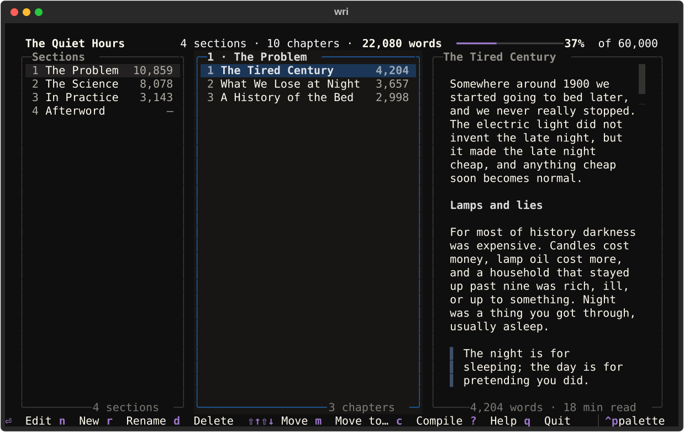
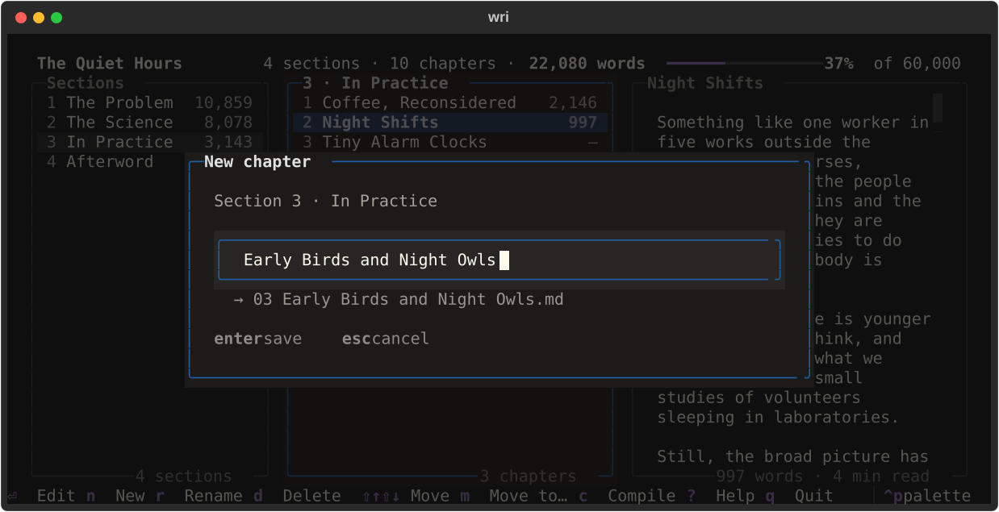
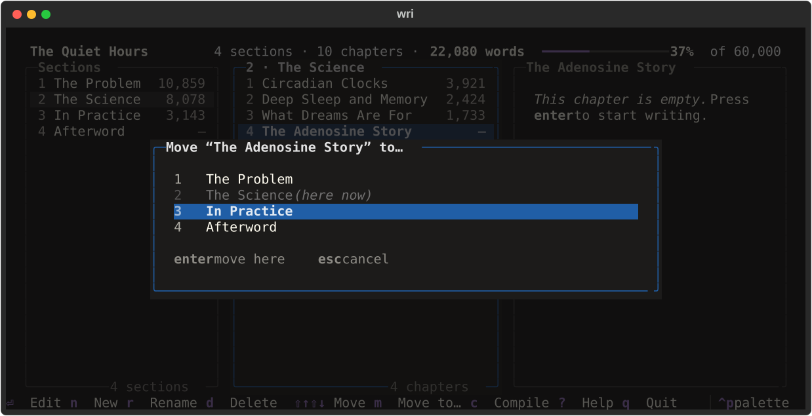
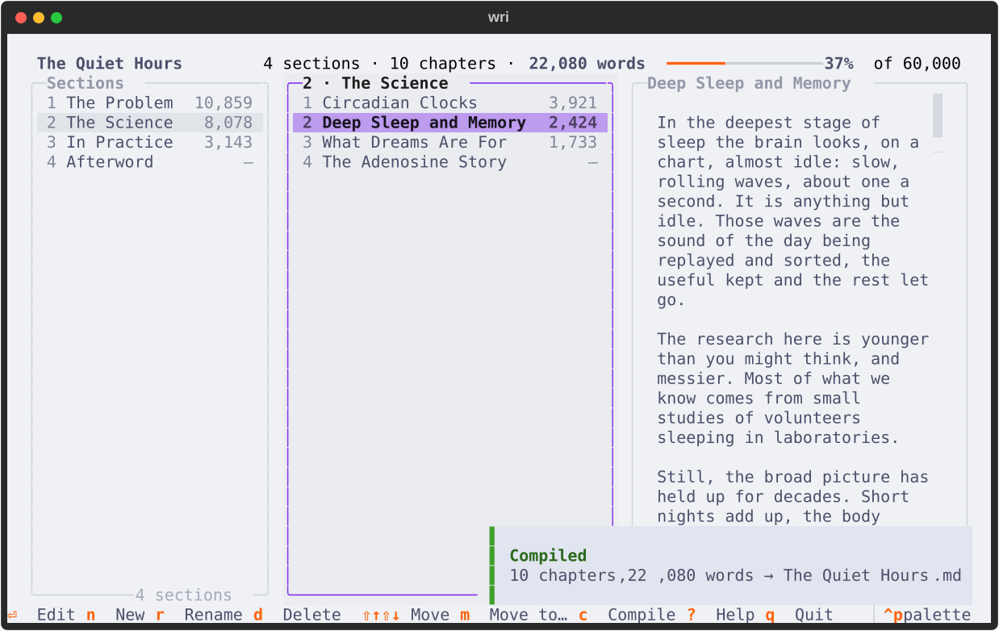

<div align="center">

# wri

**A calm terminal app for outlining and writing nonfiction books.**

Sections are folders, chapters are Markdown files, and your own editor does the writing.

[](https://github.com/adamtrain/wri/actions/workflows/ci.yml)
[](https://github.com/adamtrain/wri/releases)
[](https://www.python.org)
[](LICENSE)
[](https://textual.textualize.io)
[](https://github.com/astral-sh/uv)
[](https://github.com/astral-sh/ruff)



</div>

## Why wri

- **Plain files, forever.** A book is a folder of numbered folders holding
  numbered Markdown files. Browse it in Finder, sync it, put it in git. There's
  nothing to export and nothing to get locked into.
- **Outlining at the speed of a keypress.** Add, rename and reorder sections and
  chapters with single keys. wri renames the files as you go, so the folder
  always reads in book order.
- **Your editor, not ours.** Press enter on a chapter and it opens in `$EDITOR`,
  whether that's Vim, Helix, VS Code or anything else. wri waits, then picks up
  where you left off.
- **One key to a manuscript.** Compiling stitches every chapter into a single
  Markdown file with section and chapter headings, ready for pandoc.
- **Always know where you are.** Word counts for every chapter and section, a
  word goal with a progress bar, and a live preview of whatever is highlighted.

## Install

wri needs [uv](https://docs.astral.sh/uv/), which takes care of Python for you:

```bash
uv tool install git+https://github.com/adamtrain/wri
```

Update later with `uv tool upgrade wri`, or install a particular release by
adding its tag, e.g. `git+https://github.com/adamtrain/wri@v0.1.0`.

## Start a book

```bash
wri ~/Writing/"The Quiet Hours"
```

If the folder isn't a book yet, wri offers to make it one by adding a small
`wri.toml` settings file. After that, `wri` anywhere inside the book opens it.

From there: press **n** to add a section, **enter** to go into it, and **n**
again to start a chapter. It opens in your editor straight away. When you
close the editor you're back in wri with the word counts updated. Press **c**
to compile and **?** to see every key.

## A quick tour

**Name things; wri handles the files.** As you type a title, wri shows the
file it will become, numbered for its place in the book.

<p align="center">
  
</p>

**Move chapters between sections.** Press **m** to pick where a chapter should
go. Both sections are renumbered on disk.

<p align="center">
  
</p>

**Compile, in any theme.** Press **c** for a manuscript. That's the Catppuccin
Latte theme; **ctrl+p** opens the command palette, where you can pick a theme
(wri remembers it).

<p align="center">
  
</p>

## Your book on disk

```
The Quiet Hours/
├── wri.toml
├── 01 The Problem/
│   ├── 01 The Tired Century.md
│   ├── 02 What We Lose at Night.md
│   └── 03 A History of the Bed.md
├── 02 The Science/
│   ├── 01 Circadian Clocks.md
│   └── 02 Deep Sleep and Memory.md
└── The Quiet Hours.md        ← the compiled manuscript
```

- The number at the front of each name is its position. Whenever you add, move
  or delete something, wri renames things so the numbers run 01, 02, 03… in
  order.
- Anything without a number at the front is ignored, so `notes.md`, an
  `images/` folder or a `research/` folder can live alongside your chapters.
- Deleting moves things to a `.trash` folder inside the book. Nothing is ever
  thrown away.
- wri watches the folder, so changes you make in Finder or another app show up
  on their own.

## Keys

|                      | In sections           | In chapters                    |
| -------------------- | --------------------- | ------------------------------ |
| `enter`              | go into the section   | write: open it in your editor  |
| `n`                  | new section           | new chapter                    |
| `r` / `d`            | rename / delete       | rename / delete                |
| `⇧↑` `⇧↓` or `K` `J` | move up / down        | move up / down                 |
| `m`                  |                       | move to another section        |
| `esc` or `←`         |                       | back to the sections           |

Anywhere: `c` compile, `s` edit the book's settings, `p` show or hide the
preview, `?` help, `q` quit. `j` and `k` move the cursor, `tab` moves between
columns (tab into the preview to read a whole chapter), and `ctrl+p` opens the
command palette.

## Writing

Chapters open in `$VISUAL` or `$EDITOR`. If neither is set, wri uses the first
of `hx`, `nvim`, `micro`, `nano`, `vim` and `vi` that it finds. Editors that
open a window of their own need to be told to wait until you close the file:

```bash
export EDITOR="code --wait"   # or "zed --wait", "subl --wait"
```

## Compiling

Press **c**, or run `wri compile`, to write the whole book to one Markdown
file. Sections become `#` headings and chapters `##` headings. Headings inside
a chapter move down to fit underneath, and a first heading that only repeats
the chapter's title is dropped. So this chapter:

```markdown
# Circadian Clocks

Every cell in your body keeps time…

## Living without windows
```

turns up in the manuscript like this:

```markdown
# The Science

## Circadian Clocks

Every cell in your body keeps time…

### Living without windows
```

The book's title and author go at the top as front matter, which pandoc
understands. Front matter in chapters is left out of the manuscript, and HTML
comments don't count towards word counts, so both are handy for notes to
yourself.

```bash
wri compile                          # writes "The Quiet Hours.md" in the book
wri compile -o draft.md
wri compile -o - | pandoc -o book.docx
```

## Settings

`wri.toml` lives in the book's folder. Press **s** in wri to edit it; changes
apply as soon as you save.

```toml
title = "The Quiet Hours"
author = "Your Name"
target = 60000                    # word goal, shown as a progress bar

[compile]
output = "manuscript.md"          # default: the title + ".md"
section_heading = "Part {roman}: {title}"
chapter_heading = "Chapter {number}: {title}"   # numbered straight through the book
```

## Good to know

- **Reordering renames files.** If a chapter is open in another app while you
  move it in wri, that app may save it under its old name. Close it first.
  Editing from inside wri is always safe, because wri waits for your editor.
- **wri only works in real books.** It won't touch a folder until it has a
  `wri.toml`, and then only renumbers entries whose names start with a number.
  If you point it at a folder that already has files in it, it shows you what
  would become sections and asks first.

## Development

```bash
git clone https://github.com/adamtrain/wri && cd wri
uv run wri path/to/book       # run from the checkout
uv tool install --editable .  # or install it and keep hacking
uv run pytest
uv run ruff check
uv run ruff format
uv run ty check
uv run scripts/screenshots.py # regenerate the images in docs/
```

The screenshots show a made-up sample book that `scripts/screenshots.py`
builds.

## License

wri is dedicated to the public domain under [CC0 1.0](LICENSE). Use it however
you like.
